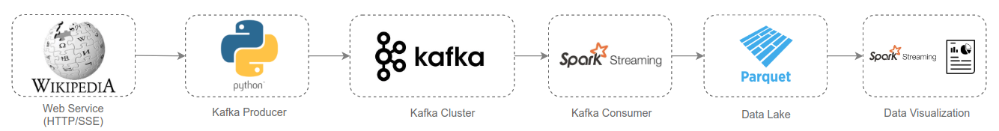

spark-kafka-consumer
============
Spark application that consumes Kafka events generated by a Python producer.

## Architecture




```
- Set the `KAFKA_ADVERTISED_HOST_NAME` variable inside the `docker-compose.yml` with your docker host IP. Note: Do not use localhost or 127.0.0.1 as the host ip if you want to run multiple brokers. More information about the variables you can configure on the kafka docker, please refer to [this](https://github.com/wurstmeister/kafka-docker#kafka-docker) repository.

- Start docker containers with compose.

```
docker-compose up -d
```
It will start the following services:
* zookeeper: 
  * Image: bitnami/zookeeper
  * Port: 2181
* kafka: 
  * Image: bitnami/kafka:
  * Port: 9092
* spark: 
  * Image: jupyter/all-spark-notebook
  * Port: 8888

Get the Jupyter Notebook URL + Token accessing the spark container

Access the container bash
```
docker exec -it docker_spark_1 bash

Then, get the notebook URL. Copy and paste the URL in the browser.
```
jupyter notebook list
```

Run the `event-producer.ipynb` notebook to start producing events from changes in Wikipedia pages to a Kafka topic. More information about the Wikipedia event [here](https://wikitech.wikimedia.org/wiki/Event_Platform/EventStreams).
   
Run the `event-consumer-spark.ipynb` notebook to start consuming events from the Kafka topic and write it in parquet files.
   
Run the `data-visualization.ipynb` notebook to read the parquet files as streaming and visualize the top 10 users that have more edits. 
